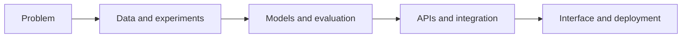

# Fateha Hossain Anushka

### Applied AI · Intelligent Systems · Backend Engineering

I build software systems that connect machine learning, data pipelines, backend APIs, and usable interfaces.

---

## About

My work focuses on **applied machine learning and intelligent software engineering**, particularly systems where a model is only one part of a larger product. I enjoy working across data preparation, model development, backend services, system integration, visualization, and deployment.

Current technical interests:

- Predictive and explainable intelligent systems
- Bangla and under-resourced-language NLP
- Healthcare AI and computer vision
- Data-intensive backend applications
- Network telemetry and software-defined networking

I currently work across backend technologies including **Spring Boot, Laravel, FastAPI, and Node.js**, choosing the stack according to the system requirements.

## Featured projects

### [ResiliNet](https://github.com/anushka06onu/ResiliNet)

**Explainable AI-Driven Network Digital Twin for Predictive QoS and Fault-Aware Routing**

An SDN research prototype integrating Mininet/OVS telemetry, a Ryu monitoring controller, rolling link features, LightGBM and SHAP inference, risk-aware path calculation, FastAPI services, and an interactive React dashboard.

`Python` `FastAPI` `LightGBM` `SHAP` `Mininet` `Open vSwitch` `Ryu` `React` `TypeScript`

---

### [ComputePulse](https://github.com/anushka06onu/computepulse)

**Predictive Cluster Intelligence for GPU Infrastructure**

A full-stack system for analysing GPU-cluster telemetry, forecasting operational risk, detecting anomalies, and supporting proactive infrastructure decisions through explainable models, backend services, and an interactive monitoring interface.

`Python` `FastAPI` `Machine Learning` `LightGBM` `Explainability` `React` `TypeScript`

---

### SCORE-BN

**Severity-Consistent and Cross-Script Robust Classification of Real-World Bangla Healthcare Queries**

A Bangla NLP research system exploring severity-aware classification, cross-script consistency, ordinal supervision, under-prioritisation penalties, transformer baselines, explainability, and lightweight web deployment for non-diagnostic healthcare-query analysis.

`Bangla NLP` `BanglaBERT` `Text-CNN` `BiLSTM` `BiGRU` `TF–IDF` `Linear SVM` `LIME` `SHAP` `FastAPI` `React`

---

### Dental Radiograph Intelligence

**Parameter-Efficient Adaptation of Vision Foundation Models for Multi-Class Dental Radiograph Analysis**

A computer-vision research project comparing DINOv2 with parameter-efficient adaptation against convolutional baselines. The experimental pipeline includes patient-separated evaluation, class-aware metrics, class-weighted learning, and visual model interpretation.

`PyTorch` `DINOv2` `LoRA / PEFT` `ResNet` `Grad-CAM` `OpenCV` `scikit-learn`

## Selected engineering projects

| Project | Technical focus | Stack |
|---|---|---|
| [DIU GCPC Portal](https://github.com/anushka06onu/GCPC-DIU) | Deployed organizational portal with Firestore-backed events, certificate verification, authenticated administration, responsive content workflows, and multi-platform deployment. | Vite, JavaScript, Firebase |
| [DIU Academic Analytics](https://github.com/anushka06onu/DIU-Academic-Analytics-Platform) | Authenticated academic-planning system with per-user records, weighted GPA/CGPA calculations, goal-feasibility analysis, interactive charts, and printable reports. | React, Firebase, Zustand, Recharts |
| [Bangla Emotion & Mental Wellness Analysis](https://github.com/anushka06onu/AI-Assisted-Bangla-Emotional-State-Detection-Platform) | Bangla text preprocessing, TF–IDF/SVM classification, local feature contributions, interactive analysis, and carefully scoped wellness communication. | Python, scikit-learn, Plotly, Bangla NLP |
| [AI Healthcare Analytics Platform](https://github.com/anushka06onu/AI-Healthcare-Analytics-Platform) | Explainable tabular machine-learning workflows and interactive analysis across multiple healthcare prediction tasks. | Python, scikit-learn, SHAP, Streamlit |

## How I work

I am most interested in projects that move beyond isolated notebooks: reproducible experiments, explicit limitations, typed interfaces, deployable services, and clear communication of what a system can—and cannot—support.

## Technical stack

### Languages

### Backend and data

### Machine learning and research

### Frontend and tooling

## Currently working on

- Strengthening ResiliNet's experiment design, live telemetry pipeline, and routing verification
- Developing Bangla NLP systems for healthcare-query analysis and cross-script robustness
- Evaluating vision foundation models for dental-radiograph classification
- Building backend APIs and data-layer components across multiple backend stacks

---

[LinkedIn](https://linkedin.com/in/fatehahossainanushka) · [Email](mailto:fatehahossainanushka@gmail.com)

